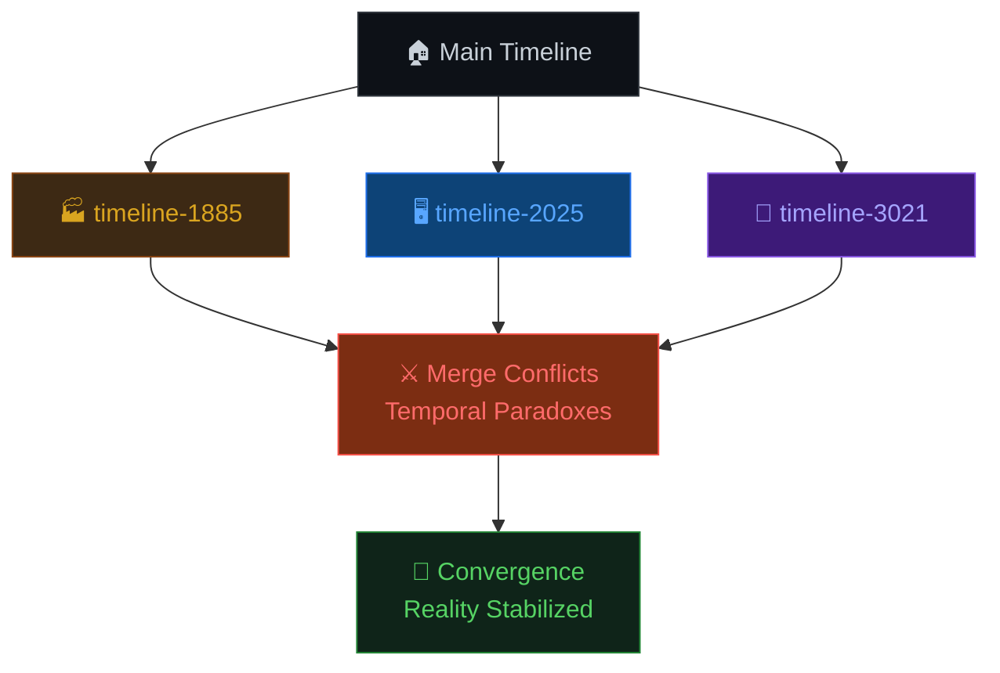

# 🕰️ The Digital Time Travelers ⚡
A creative **Git branching project** where each branch represents an alternate timeline in a sci-fi story.  
Branches = Timelines, Merges = Convergence of Realities 🌌✨

<div align="center">


</div>

---

## 📖 Story Timelines 🎭

<details>
<summary>🏭 <strong>timeline-1885</strong> → <em>The Steam Punk Era</em> ⚙️</summary>

> Professor Montgomery's difference engine sparks to life, gears clicking as the age of steam meets early computation.
> 
> 🔧 **Tech**: Brass mechanisms, steam power, mechanical computation  
> 🎩 **Characters**: Professor Algernon Montgomery, Cogsworth (automaton)  
> ⚡ **Discovery**: Ancient algorithms embedded in Victorian machinery

</details>

<details>
<summary>🖥️ <strong>timeline-2025</strong> → <em>The AI Awakening</em> 🤖</summary>

> Dr. Sarah Chen activates the quantum computer, tearing open a portal through spacetime.
> 
> 💻 **Tech**: Quantum computing, AI systems, climate modeling  
> 👩‍🔬 **Characters**: Dr. Sarah Chen, Marcus (lab partner)  
> 🌍 **Mission**: Save the world from climate collapse through time manipulation

</details>

<details>
<summary>🌟 <strong>timeline-3021</strong> → <em>The Futuristic Era</em> 🧠</summary>

> The last humans, connected by neural implants, rediscover ancient code that changes reality itself.
> 
> 🔮 **Tech**: Neural implants, quantum foam consciousness, crystalline interfaces  
> 👤 **Characters**: Zara-7, ARIA (AI companion)  
> 🌌 **Reality**: Digital consciousness merged with cosmic data streams

</details>

<details>
<summary>🎯 <strong>main</strong> → <em>Convergence</em> 🌈</summary>

> All paradoxes are resolved, merging past, present, and future into one stabilized universe.
> 
> ♾️ **Result**: Eternal temporal loop where all timelines coexist  
> 🔄 **Status**: Reality.exe has stopped crashing  
> ✅ **Achievement**: Time travel mastery unlocked!

</details>

---

## ⚙️ How It Works 🔄



1. Each branch (`timeline-1885`, `timeline-2025`, `timeline-3021`) contains part of the story 📚
2. Branches are merged back into `main`, simulating **timelines converging** 🌪️
3. Merge conflicts are treated as **temporal paradoxes**, resolved manually in `timeline.html` ⚡

---

## 🚀 How to Explore the Timelines

### 🔧 Installation & Setup
```bash
# Clone the temporal repository
git clone https://github.com/Altriors/timeline_stories.git
cd timeline_stories

# Initialize your time machine
git status
```

### 🕐 Navigate Between Timelines
```bash
# Jump to 1885 (Steam Age)
git checkout timeline-1885
open timeline.html  # Experience Victorian steampunk

# Travel to 2025 (AI Revolution)  
git checkout timeline-2025
open timeline.html  # Witness the quantum breakthrough

# Leap to 3021 (Post-Human Era)
git checkout timeline-3021
open timeline.html  # Enter the neural network reality

# Return to stabilized timeline
git checkout main
open timeline.html  # See all realities merged
```

---

## 🎨 Visual Features ✨

<div align="center">

### 🎭 Timeline Aesthetics

| Timeline | Color Scheme | Atmosphere | Tech Level |
|----------|--------------|------------|------------|
| 1885 🏭 | `#8b4513` Bronze & Steam | Victorian Gothic | ⚙️⚙️⚡ |
| 2025 🖥️ | `#00ff00` Cyber Green | Digital Matrix | 🤖🤖🤖🤖 |
| 3021 🌟 | `#a5a5ff` Cosmic Purple | Neural Dreams | 🧠🧠🧠🧠🧠 |
| Main 🌈 | `#ffffff` Pure Light | Reality Stable | ♾️♾️♾️♾️♾️♾️ |

</div>

---

## 🎯 Learning Objectives 🧠

<div align="center">


  


</div>

- 🌿 **Branching**: Master Git branches through timeline metaphors
- ⚔️ **Conflict Resolution**: Solve merge conflicts as temporal paradoxes  
- 🤝 **Collaboration**: Work with teammates across different realities
- 🎨 **Creative Coding**: Build engaging narratives with HTML/CSS
- 🔄 **Version Control**: Experience Git as universe management

---

## 🏆 Achievements System 🎮

<div align="center">

### 🥇 Unlock Your Temporal Badges!

</div>

| Badge | Requirement | Reward |
|-------|-------------|--------|
| 🕐 **Time Novice** | Create first timeline branch | Basic temporal access |
| ⚔️ **Paradox Resolver** | Solve 3 merge conflicts | Advanced reality control |
| 🌈 **Timeline Master** | Successfully merge all branches | Universe management rights |
| 👥 **Temporal Team Lead** | Collaborate with 3+ people | Multiverse coordinator status |
| 🚀 **Reality Architect** | Add custom timeline | Timeline creation privileges |

---

## 🛠️ Advanced Customization 🎨

<details>
<summary>🎭 <strong>Add New Timelines</strong></summary>

```bash
# Create your own timeline
git checkout -b timeline-[YEAR]
# Examples: timeline-1969, timeline-2199, timeline-medieval

# Add your story content
nano timeline.html  # Edit with your timeline story

# Commit your reality
git add timeline.html
git commit -m "Add Timeline [YEAR]: [Your Epic Title]"

# Merge into main timeline
git checkout main
git merge timeline-[YEAR]
```

</details>

<details>
<summary>🎨 <strong>Style Customization</strong></summary>

```css
/* Add to timeline.html <style> section */

/* Timeline-specific styling */
.timeline-1885 { 
    background: linear-gradient(45deg, #8b4513, #daa520);
    animation: steamPulse 2s infinite;
}

.timeline-2025 { 
    background: linear-gradient(45deg, #000000, #00ff00);
    animation: matrixGlow 1.5s infinite alternate;
}

.timeline-3021 { 
    background: linear-gradient(45deg, #4c1d95, #a855f7);
    animation: quantumShift 3s infinite ease-in-out;
}

@keyframes steamPulse {
    0%, 100% { opacity: 0.8; }
    50% { opacity: 1; }
}

@keyframes matrixGlow {
    from { box-shadow: 0 0 20px #00ff00; }
    to { box-shadow: 0 0 40px #00ff00, inset 0 0 20px #003300; }
}

@keyframes quantumShift {
    0% { transform: translateX(0); }
    33% { transform: translateX(10px) rotateY(10deg); }
    66% { transform: translateX(-10px) rotateY(-10deg); }
    100% { transform: translateX(0); }
}
```

</details>

---

## 🌟 Community & Support 💫

<div align="center">

### Join the Temporal Community!

[](https://discord.gg/timetravelers)
[](https://github.com/Altriors/timeline_stories/discussions)

</div>

### 🤝 Contributing
1. 🍴 Fork the repository
2. 🌿 Create a new timeline branch  
3. ✍️ Add your story content
4. 🔀 Submit a pull request
5. 🎉 Collaborate on temporal convergence!

---

## 📊 Project Stats 📈

<div align="center">


### 🏆 Timeline Statistics
- **⏰ Timelines Created**: 3+ (and growing!)
- **⚔️ Paradoxes Resolved**: ∞
- **🌍 Realities Saved**: All of them
- **🎓 Git Concepts Mastered**: Branching • Merging • Collaboration • Conflict Resolution

</div>

---

<div align="center">

### 🎭 *"Time is not linear when you're coding reality."*
— *Dr. Sarah Chen, Timeline 2025* ⚡

---

**⭐ Star this repo if you've successfully traveled through time! ⭐**

[](https://github.com/Altriors)
[](https://git-scm.com/)
[](https://github.com/Altriors/timeline_stories)

</div>
